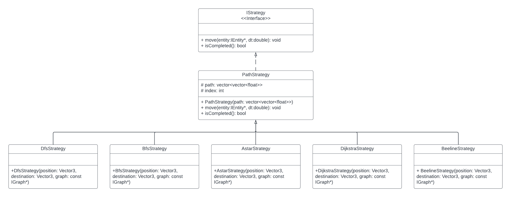
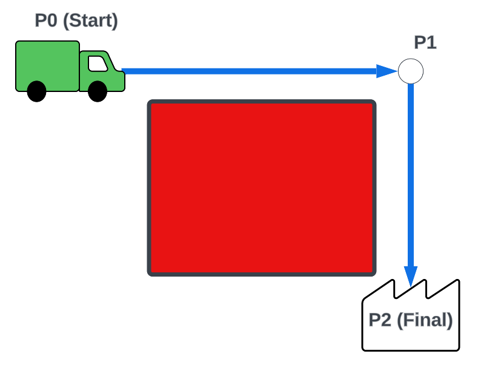

# 3081 Lab 8: Strategy Design Pattern
_(Due: Thursday, October 31st, 2024 @ 11:59pm)_

## Accessing a Lab Machine

For this assignment, you should make sure you are using our shared CSE development environment.  As such, you should use a lab machine in ***Keller Hall 1-250*** or ***Keller Hall 1-262*** ([details](https://cse.umn.edu/cseit/classrooms-labs#cselabs)).  If you do not have physical access to one of the lab computers, you can also access a lab machine remotely using [SSH](https://github.umn.edu/umn-csci-3081w-f24-sec010/FAQ/blob/main/SSH/README.md) or a web-based service called [VOLE](https://github.umn.edu/umn-csci-3081w-f24-sec010/FAQ/blob/main/VOLE/README.md). If using VOLE, be sure to use VOLE-FX3 for full compatibility.  You will use your CSE Labs account to login to the lab machines. If you do not already have an account, create the account following these [instructions](https://wwws.cs.umn.edu/account-management).


**IMPORTANT: Inside the lab machine, only files saved to your home folder (e.g., `/home/lorim007`) will persist across sessions. If you log out, make sure your progress is pushed to GitHub or saved in the home folder.**

## Retrieve Class Materials

1. Clone your team's repository for the lab.  This will require your section number and your team number.  If you need a reminder of your team number, check the announcements on Canvas for the project groups that were released.  You will be able to view the master list of groups with their associated numbers. **Replace the `teamNumber` with your team number x500.**.
	```bash
	git clone git@github.umn.edu:umn-csci-3081w-f24-sec010/team-teamNumber-lab07.git
	```
	Example: If you're team-081, your command would be...
	```bash
	git clone git@github.umn.edu:umn-csci-3081w-f24-sec010/team-081-lab07.git
	```

## What's in the lab08 folder?

<ul>
    <li>  <code>README.md</code>: You're reading this right now.
    <li>  <code>.gitignore</code>
    <li>  <code>dependencies</code>: A folder that contains external tools and libraries to compile and run the project.
    <li>  <code>docs</code>: Documentation files
    <li>  <code>service</code>: A folder with base code.  This contains:
   	 <ul>
   		 <li>  <code>include</code>: Header files
   		 <li>  <code>src</code>: Source files
   	 </ul>
    <li>  <code>web</code>: Front-end files
</ul>

## What You Will Do

1. Implement the strategy design pattern for movement
1. Implement different pathing strategies
1. Integrate movement strategies into entities to make them to move
1. Test and validate the implementation and integration of the movement strategy design pattern


# Lab Instructions

The goal of this lab is for you to implement the movement of entities by integrating the strategy design pattern that you have learned during lecture.

Currently packages, robots or drones will not move within the simulation even if packages have been scheduled for delivery. In lab 6, we learned how to import new assets  and entities such as the human and helicopter into our simulation. But we also touched on how to make these entities move. In this lab, we will refactor the movement within our simulation and implement a more robust design.

## Entity Movement and Behaviors
Right now, we have five entities within our simulation. The drone, robot, package, helicopter, and human that all have different behaviors that affect how they move. Below are the different behaviors/movements that the entities **will have** at the end of this lab.
* **Helicopter**: The helicopter moves linearly to random locations above the map.
* **Human**: Humans will wander randomly around the map using the Astar path search strategy.
* **Package**: The package gets carried by the Drone from its pickup location to the robot customer drop off location.
* **Robot**: Waits for its package to arrive. _So nothing_.
* **Drone**:
  1. Idle until it is assigned a package to deliver
  1. Moves in a straight line to the pickup location of the package
  1. Picks up the package
  1. Moves using package's specified movement strategy to the robot drop off location
  1. Drops the package off and waits for the next package to be assigned.

  Note: _The Drone moves the package. The package does not move on its own._

## Strategy Design Pattern

Within our simulation, there are many different ways that the drone can move, but how do we integrate this movement into the drone and other entities within our simulation? Should we just repeat what we did in lab 6 for every entity? No! If you haven't guessed it by now from the lab title or any of the sections above, the solution is the strategy design pattern! Here are a few reasons we will want to use this pattern for movement within our system.
- **Extensibility**: _(O of solid)_ We can add new movement without strategies having to modify existing code
- **Encapsulation**: Each strategy is encapsulated within its own class promoting separation of concerns.
- **Reusability**: Multiple entities will be able to move, sometimes using the same movement strategy (In a straight line vs path search movement). This will allow us to implement these movement strategies once, and reuse them for multiple entities.
- **Runtime Behavior Selection**: Step 4 of the drone says that the movement of the drone from the package's initial location to the drop off location can change at runtime. This can be set when scheduling a delivery using the menu. With this, we can have the movement of the drone change at runtime as the movement strategies are interchangeable through inheritance from an interface class.

To read more about the Strategy Design Pattern, check out [refactoring.guru](https://refactoring.guru/design-patterns/strategy).

<p align="center"></p>

There will be five types of movement strategies that will be implemented in this lab.

* **Beeline** _straight line movement_
* **Astar**
* **Dijkstra**
* **DFS**
* **BFS**


You do not need to implement these routing algorithms as we have already provided the routing algorithms for you. Your job is to integrate them with the strategy design pattern.

See the files below for Routing Algorithms
```
<repo_dir>/service/include/routing/routing
<repo_dir>/service/src/routing/routing
```

**READ ALL TASKS AS THEY WILL CONTAIN INFORMATION THAT WILL BE IMPORTANT WITH OTHER TASKS!**

Like we did with the factories in last week's lab, create the strategy files in a "strategy" folder in the source and include directories.
```
<repo_dir>/service/include/simulationmodel/strategy
<repo_dir>/service/src/simulationmodel/strategy
```
At the end of this lab, you should have the following new files:
<ul>
    <li>  <code>service</code>
   	 <ul>
   		 <li>  <code>include</code>: Header files
            <ul>
               <li><code>simulationmodel</code></li>
               <ul>
                  <li><code>strategy</code></li>
                  <ul>
                     <li><code>IStrategy.h</code></li>
                     <li><code>AstarStrategy.h</code></li>
                     <li><code>BeelineStrategy.h</code></li>
                     <li><code>BfsStrategy.h</code></li>
                     <li><code>DfsStrategy.h</code></li>
                     <li><code>DijkstraStrategy.h</code></li>
                     <li><code>PathStrategy.h</code></li>
                  </ul>
               </ul>
            </ul>
   		 <li>  <code>src</code>: Source files
            <ul>
               <li><code>simulationmodel</code></li>
               <ul>
                  <li><code>strategy</code></li>
                  <ul>
                     <li><code>AstarStrategy.cc</code></li>
                     <li><code>BeelineStrategy.cc</code></li>
                     <li><code>BfsStrategy.cc</code></li>
                     <li><code>DfsStrategy.cc</code></li>
                     <li><code>DijkstraStrategy.cc</code></li>
                     <li><code>PathStrategy.cc</code></li>
                  </ul>
               </ul>
            </ul>
   	 </ul>
</ul>


## Task 1 - IStrategy and PathStrategy ##


### IStrategy ###
IStrategy is our interface base class that will allow us to use polymorphism to swap movement strategies at runtime as well as act as our template for inheriting classes. Create the interface class `IStrategy` using the UML shown above which has two methods:
* `move(entity: IEntity*, dt: double): void`: Moves the specified entity over some time delta `dt`.
* `isCompleted(): bool`: Returns true if the strategy is done.

### PathStrategy ###
`PathStrategy` is the heavy lifter in this lab. From the UML, we can see that it implements both the `move` and `isCompleted` methods, but before we start writing code here, we'll need a quick refresher on how entities move in the simulation and what we need `vector<vector<float>> path` and `int index` for.

#### Movement Refresher
In Lab06, we were able to make entities move by modifying their `position` attribute. We also can change the direction that the entity is facing by modifying the `direction` attribute. We get the difference vector by subtracting the destination from the entity's position. The unit vector of this is our direction that we are facing. Lastly, we move the entity by scaling the direction vector by speed and `dt` to get how far the entity moves in that time delta. To get an example of this, see the solution for last week's lab, and this week's base code by looking in either `helicopter.cc`,`human.cc` or the following example.
```c++
   // Difference vector between entity and the destination
   Vector3 difference = destination - position;

   // Update the direction of the entity to face its destination
   direction = difference.unit();

   // Move the entity in the direction scaled by it's speed and dt
   position = position + (direction * speed * dt);
```

#### PathStrategy Components
Movement throughout our simulation is not as simple as moving in a straight line. To make it more realistic we need to path around objects like buildings or over bridges across the river. Much like riding in the car or walking to class, you don't beeline it straight to the location you're heading to, but have some route or path that you've broken up into a bunch of straight lines that helps you navigate around things. This is the same thing we are doing here. The `path` being a list of positions with all positions that the entity will travel to. Once the entity is at the last position in the path the strategy is done. _Note: Think about the relation of the position to the `index` of the strategy. Might we be able to get a simple explanation for `isCompleted` using index?_

Example:



Here we see the green truck wants to move to the final position on the other side of the red cube, though it can not move through the cube. We have an intermediate point "P1" that will help us navigate around the red square and from there, the truck can then navigate to the final position "P2". The `path` in this case would be in list form `{P0,P1,P2}` starting from index 0.

Now you should be able to implement both methods of the PathStrategy class.

_Hint: Check vector3's documentation for easier ways to convert float vectors into vector3s and vice versa._

## Task 2 - Path Strategies ##

Like previously mentioned, we've already provided you with the search algorithms that will return a list of points that compose the path from the start position to the end destination. Take a look at the header files in `service/include/routing/routing` to get a better understanding of the classes you will be using here.

Paths are generated from the simulation's graph where the `graph` is the collection of points and relations between these points. The routing algorithms traverse this graph to create a path from the starting position to the final destination and return the resulting path which is a vector of float vectors. Take a look at `IGraph`s documentation for a method that will use a start and end position as well as a routing strategy that will return the path. Because the movement logic of the entity along the path is implemented within PathStrategy, all that needs to be done for the children's movement strategies is setting the path. _Most strategies will use the routing strategies `Default()` method, Dijkstra's will use `Instance()`._

## Task 3 - Integration ##

**This task should be done by two members in groups of 4, and 1 member in groups of 2.**

With the movement strategies implemented and ready to go, we can now refactor movement with our entities within the simulation. Right now, we have 3 different kinds of entities that move within the simulation. The helicopter, the human and drones that move the packages.

**Entities will contain a strategy** that they will use in their update function to move the entity.
Our strategies’ move methods take in an IEntity pointer. Like previously stated, the strategy is in charge of moving the entity, not the entity. This is to decouple movement from entities and make it easier to modify or extend the system in the future. For this reason, the move functions are defined as
```c++
void move(IEntity* entity, double dt);
```
Where `entity` is the entity that we are moving. If we are within the scope of the entity, we can reference the entity with the `this` keyword. _Note: When creating new strategies, make sure to delete old strategies._

### Helicopter
Helicopters move in a straight line to their target destination as they are not restricted by the environment. We can reuse some of the existing logic for destination generation and create a new **BeelineStrategy**  that the helicopter will use to move. The logic for this is now simple and can go as follows.
1. If the movement strategy is null or is done
   1. Generate a new random destination
   1. Create and replace the movement strategy with the newly created strategy
1. Otherwise, move the entity using the movement strategy


### Human
The human will now have a more "exciting" behavior as it will move randomly around the map. Though unlike the helicopter, the human can't move in a straight line as they're not ghosts and can not pass through obstacles. Because of this, they will be utilizing the **AStarStrategy** as their strategy to move around the simulation. Beyond this difference, the human's and helicopter's update logic will be relatively the same by following the steps listed above in the [Helicopter task section](#helicopter).

### Drone and Packages

Now that you understand the basics of utilizing and creating a new strategy, it's time to give the drones movement.
> If drones are available, they are checking if the model has packages available for delivery. Upon receiving a package/assignment, they will move in a straight line to the package. Once they have picked up the package, they move using the package's specified movement strategy to plan a route to the package's drop off location. After dropping off the package, they revert back to checking if there are packages available for delivery.

"MovementStrategies move the drones, the drones move the packages". Much like how the movement strategies move the entity using `IEntity::setPosition` and `IEntity::setDirection`, the drone can modify the position and direction of the package since the drone has a reference to the package.

* We need two strategies.
   * One strategy going from the initial location to the package's initial location.
   * Another strategy going from the package's initial location to its drop off location.
* The strategies should be created once they assigned their next delivery. Not while they're in motion.
* The string of strategies that the package will contain is one of the following:
   * "astar"
   * "dijkstra"
   * "dfs"
   * "bfs"
* Create another drone at startup with a different name like how we created a helicopter and human at startup in [lab06](https://github.umn.edu/umn-csci-3081w-f24-sec010/public-lab06).

Once you have completed this task, you should be able to create multiple packages, each with a different or similar path strategy. The drone will then travel directly to the package, pick it up, and utilize the designated path strategy to transport it to the designated robot. After dropping off the package, the drone will proceed to deliver the next package. _For quicker testing, we suggest using AStar or Dijkstra as BFS and DFS can take a long time to complete._

# Final Submission
**One submission per group. Designate someone to make the submission, then add members to the submission!**

Before submitting, make sure that...
- Your code compiles and runs from a clean directory.
   - `make clean; make -j`
- Appropriate Doxygen documentation is generated with `make docs`
- You have NO CPP lint errors from `make lint`
   ([FAQ: How to make lint and use clang-format](https://github.umn.edu/umn-csci-3081w-f24-sec010/FAQ/tree/main/VSCode%20CPPLint))
- Your teammates do a code review on your pull request into the dev branch.

To submit your lab:

1. Create a pull request from your team's development branch into your main branch.

   [FAQ: How to Create a Pull Request on Github](https://github.umn.edu/umn-csci-3081w-f24-sec010/FAQ/tree/main/Github%20Pull%20Requests)


1. Get the latest commit ID from your development branch and submit it to the Gradescope assignment "Lab08: Strategy Design Pattern" with your team name. Only 1 group member should submit a gradescope assignment for the lab. Make sure that you add your teammates to the submission. See the FAQ link below on how to do this.  **DO NOT merge the pull request.**

   [FAQ: How to get a commit ID](https://github.umn.edu/umn-csci-3081w-f24-sec010/FAQ/blob/main/Commit%20ID/README.md)

     [FAQ: Gradescope Group Submissions](https://github.umn.edu/umn-csci-3081w-f24-sec010/FAQ/blob/main/Gradescope%20Include%20Teammates/README.md)

Once you have done both steps above, you have completed the lab.


