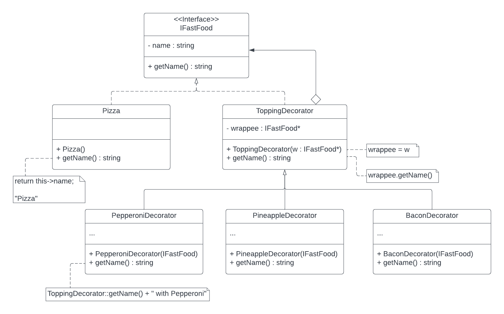
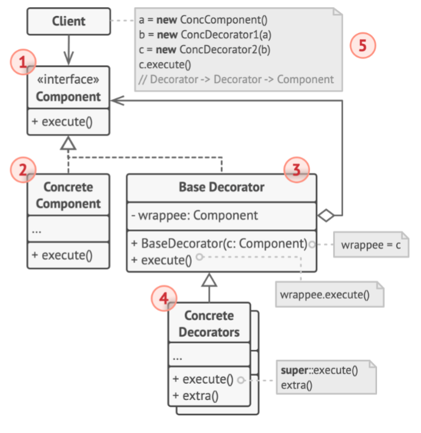
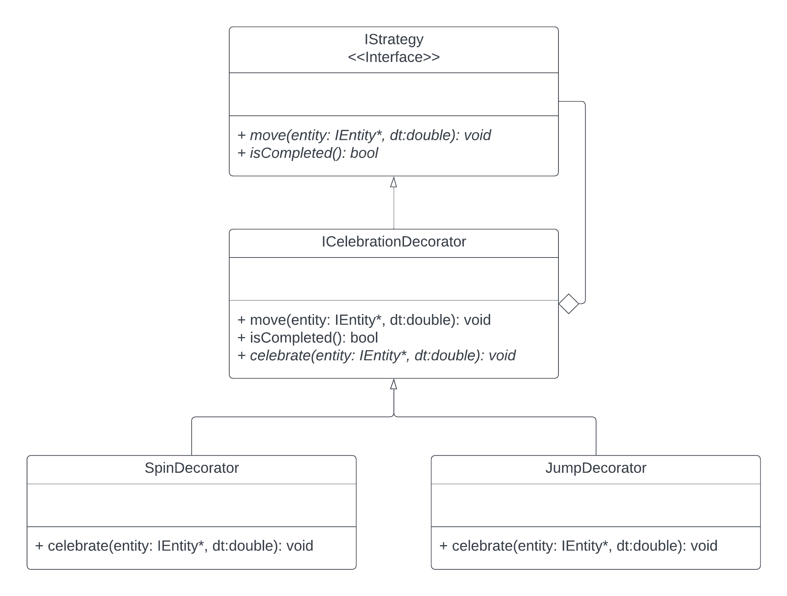
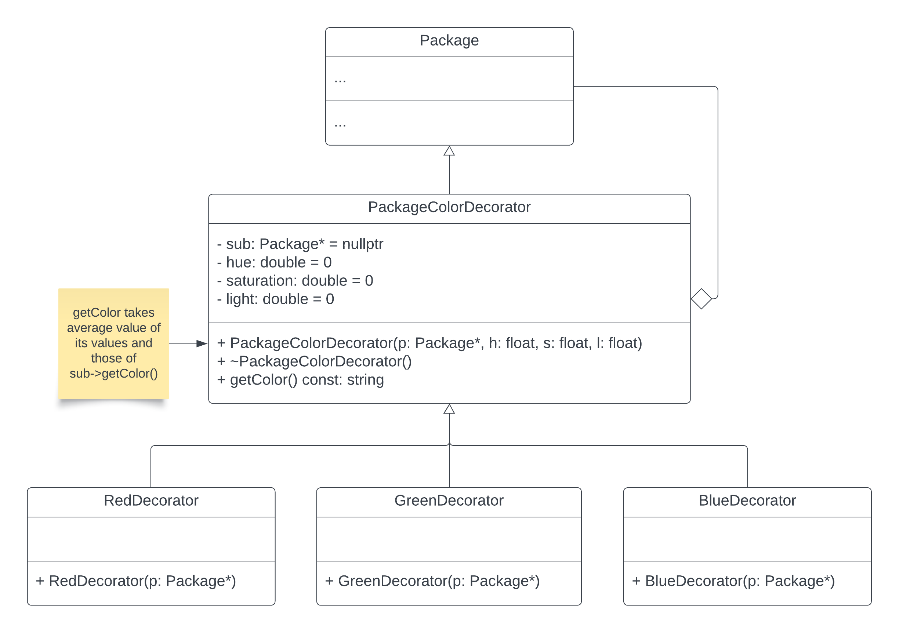

# 3081 Lab 9: Decorator Design Pattern
_(Due: Thursday, November 7th, 2024 @ 11:59pm)_

## Accessing a Lab Machine

For this assignment, you should make sure you are using our shared CSE development environment.  As such, you should use a lab machine in ***Keller Hall 1-250*** or ***Keller Hall 1-262*** ([details](https://cse.umn.edu/cseit/classrooms-labs#cselabs)).  If you do not have physical access to one of the lab computers, you can also access a lab machine remotely using [SSH](https://github.umn.edu/umn-csci-3081w-f24-sec010/FAQ/blob/main/SSH/README.md) or a web-based service called [VOLE](https://github.umn.edu/umn-csci-3081w-f24-sec010/FAQ/blob/main/VOLE/README.md). If using VOLE, be sure to use VOLE-FX3 for full compatibility.  You will use your CSE Labs account to login to the lab machines. If you do not already have an account, create the account following these [instructions](https://wwws.cs.umn.edu/account-management).


**IMPORTANT: Inside the lab machine, only files saved to your home folder (e.g., `/home/lorim007`) will persist across sessions. If you log out, make sure your progress is pushed to GitHub or saved in the home folder.**

## Overwritten Unique Changes

All students are given the same base code for labs which are the solutions to the previous lab. If you had any personal changes or implementations in previous labs that you want carried forward to the current or future labs, those changes will need to be manually copied over by you, the developer.


## Retrieve Class Materials

1. Clone your team's repository for the lab.  This will require your section number and your team number.  If you need a reminder of your team number, check the announcements on Canvas for the project groups that were released.  You will be able to view the master list of groups with their associated numbers. **Replace the `teamNumber` with your team number x500.**.
	```bash
	git clone git@github.umn.edu:umn-csci-3081w-f24-sec010/team-teamNumber-lab09.git
	```
	Example: If you're team-081, your command would be...
	```bash
	git clone git@github.umn.edu:umn-csci-3081w-f24-sec010/team-081-lab09.git
	```

## What's in the lab09 folder?

<ul>
	<li>  <code>README.md</code>: You're reading this right now.
	<li>  <code>.gitignore</code>
	<li>  <code>dependencies</code>: A folder that contains external tools and libraries to compile and run the project.
	<li>  <code>docs</code>: Documentation files
	<li>  <code>service</code>: A folder with base code.  This contains:
  	  <ul>
  		  <li>  <code>include</code>: Header files
  		  <li>  <code>src</code>: Source files
  	  </ul>
	<li>  <code>web</code>: Front-end files
</ul>


## Lab Instructions

### Goal
  The primary goal of this lab is for you to implement the strategies' celebration decorator design pattern. Once the drones deliver their package to their destination, the movement uses the decorator pattern to add celebration upon the completion of its delivery.

## Tasks
| ID | Title | Task Summary Description | Task Deliverable |
| :---: | --- | --- | --- |
| | Decorating Movement | | |
| Task 1a | Decorator Design Pattern | Create decorator classes | Source Code |
| Task 1b | Decorator Design Pattern | Implement the use case for decorators | Source Code |
| Task 1c | Doxygen | Create documentation of the classes/functions that you create | HTML/Source Code |
| Task 1d | Code Styling | Match your code style with Google style guidelines | Source Code |
| | Decorating Packages | | |
| Task 2a | Decorator Design Pattern | Create decorator classes | Source Code |
| Task 2b | Decorator Design Pattern | Implement the use case for decorators | Source Code |
| Task 2c | Doxygen | Create documentation of the classes/functions that you create | HTML/Source Code |
| Task 2d | Code Styling | Match your code style with Google style guidelines | Source Code |

## Concept: Decorator Pattern

The Decorator Pattern is used for adding more behaviors/functionality to an object at runtime without modifying the decorated object.

<p align="center"> </p>

A great example of the decorator pattern is pizza toppings. In this analogy the pizza base is first created and the toppings are added later onto it. Every time toppings are added, the price of the pizza increases depending on the toppings. The toppings can add not only to the pizza but also other types of food if it exists as well.

Example Use

```c++
…
vector<FastFood*> pizzas;
pizzas.push_back(new Pizza()); // a plain pizza
pizzas.push_back(new PineappleDecorator(new Pizza())); // a pineapple pizza
pizzas.push_back(new BaconDecorator(new PepperoniDecorator(new Pizza()))); // a bacon pepperoni pizza
pizzas.push_back(new BaconDecorator(new BaconDecorator(new Pizza()))); // a bacon pizza with extra bacon
…
for (FastFood* ff : pizzas) {
  delete ff;
}
…
```

Notice that we can wrap pizzas with multiple decorators. We can even wrap pizzas with the same decorator multiple times.

Here is an example of the `getPrice()` method for the decorators.
```c++
double ToppingDecorator::getPrice() {
  return this->price + fastFood->getPrice();
}
```
Which will return the price of the added topping and whatever fastFood the topping decorated. This execution flow is shown in lecture slides in the note in the top right _(Comment in step 5)_.

<p align="center"> </p>

## Decorating the Strategies

Because we will be decorating the strategies, instead of making a decorator folder inside the simulation folder, we will be making a decorator folder inside the strategy folder.
```
<repo_dir>/service/include/simulationmodel/strategy/decorator
<repo_dir>/service/src/simulationmodel/strategy/decorator
```

### Task 1a (Create Decorator Classes)


<p align="center"> </p>

*Note: This UML is the addition of the UML that we used for Strategy Pattern*<br>

The entities will celebrate once they get to their destination by spinning and/or jumping. We will implement this by using the decorator pattern. For this lab, we require that you implement spinning and jumping as celebrations. If you would like to be creative and add your own extra celebrations to the other entities like Human and Helicopter feel free to do so, but the Drone should follow the specified celebrations.

### Steps:
1. You will be implementing the **Decorator Design pattern** shown above. The methods and attributes do not need to be the exact same, this is just one way to implement it. But the UML graph relation of your solution must be the same.
2. Create `ICelebrationDecorator` classes. 
    - Attributes
        - `strategy`: The IStrategy that we want to add current decorator onto
        - `celebrationTime`: time count to check how long the celebration has occurred
    - Methods
        - `Constructor(strategy)`: set the time to 0, set provided strategy as its own
        - `move(...)`: Check if previous strategy has completed, if so, do current strategy movement/celebration (i.e., spin or jump), else do previous strategy
            - Note: Make sure spinning or jumping looks good and not too fast or too slow. This is something that may require a bit of trial and error.
        - `isCompleted()`: Check if the current strategy has completed. Current strategy will complete only if the celebration has gone on for 4 or more seconds.
3. Create `SpinDecorator`, and `JumpDecorator` classes.
4. Implement `celebration` for concrete decorators
    - `SpinDecorator::celebrate(...)`: Rotate the entity by some spin speed scaled by the difference in time.
      - _hint: We already have a rotate function for entities_
    - `JumpDecorator::celebrate(...)`: The entity may jump more than once over the duration of the celebration. If the entity is moving up, change its position by some interval scaled by time, and if they get to a max height, have them start going down to some floor value.
      - _hint: This may require some extra attributes within the `JumpDecorator` class_

### Task 1b (Use the decorators)

Steps:
1. Use the created decorators from [Task 1](#task-1-create-decorator-classes) inside `drone.cc` to wrap the movement strategies with the corresponding decorator strategies.
    - A-star : only jump
    - DFS : spin first, then jump
    - BFS : spin then spin
    - Dijkstra : jump first, then spin

**Hint**: *Use the UML diagram provided for the strategy design pattern to get started.*

Upon completion of implementing the decorator design pattern, once the drone and package have reached their destination, the drone will celebrate according to its movement strategy pattern.

### Task 1c (Doxygen)
Write Doxygen for all the **NEW** classes you create. Which in our case for this lab, are as follows:
- ICelebrationDecorator.h/.cc
- SpinDecorator.h/.cc
- JumpDecorator.h/.cc

### Task 1d (Code Style)
Match your new code's style with Google Code Styling guide. Which in our case for this lab, is as follow:
- ICelebrationDecorator.h/.cc
- SpinDecorator.h/.cc
- JumpDecorator.h/.cc

## Decorating Packages

Because we will be decorating the package, instead of making a decorator folder inside the simulation folder, we will be making a decorator folder inside the entity folder.
```
<repo_dir>/service/include/simulationmodel/entity/decorator
<repo_dir>/service/src/simulationmodel/entity/decorator
```

### Task 2a (Create Color Decorators)

Create a `Package` decorator that changes the color of packages. The decorator should store its own color and override the `getColor` function so that it takes the “average” color of its stored color and that of the decorated package. Average color is a bit hard to define, but for our purpose we will simply take the average hue of the colors (**MANDATORY**: look into [HSL color representation](https://www.w3schools.com/html/html_colors_hsl.asp)). Here is a UML of the new classes:

<p align="center"> </p>

The string returned by `getColor` can be in an HSL format, it will be the same format as that used in the front-end (look at the format in the link). In order to properly perform these operations, you will need to be able to parse and output formatted string in that HSL format, so for your convenience, here is a format string that you can use:
```c++
auto format = "hsl(%lf, %lf%%,  %lf%%)";
```
You can use that format string with functions such as `sprintf` and `sscanf` for input parsing and output. Finally, for simplicity's sake, if the sub class’s `getColor` function returns a string which does not match the format, do not worry about trying to average colors or anything, just return the HSL values stored in the decorator class.


### Helper code to parse a string in C/C++
Here are some helper code snippets that will help get you started.
1. Grab the color string from the sub-component. 
    ```c++
    auto sub_color = sub->getColor();
    ```
1. Declare some double values that we can read from our `sub_color` string into.
    ```c++
    double h, s, l;
    ```
1. Parsing the `sub_color` string and reading out it's components.
    ``` c++
    sscanf(sub_color.c_str(), format, &h, &s, &l) == 3
    ```
    1. Do a string scan from the `sub_color` checking to see if it matches our `format`ed string. Since `sscanf` is a C library method, we need to convert our `sub_color` string into a C like string.
    1. Since our format has 3 components that it will match on, noted with `%lf`, we provide it with the address of `h`, `s`, and `l` so that it can read the values into the memory space.
    1. Lastly, `sscanf` returns how many elements it was able to match. Since we are trying to match `h`, `s`, and `l`, if the function returns 3, `h`, `s`, and `l` will be occupied with the values given in `sub_color`. If it does not return 3, then we can assume it failed to match and parse the values.

    Now at this point, if the above method was successful in parsing an example string of `"hsl(120, 100%, 50%)"`, the values would be as follows.
    ```yaml
    h: 120.0
    s: 100.0
    l: 50.0
    ```
    
A lot of the functionality can just go in `PackageColorDecorator`, then the subclasses merely need to set the variables to appropriate values in their constructors.

### Task 2b (Change PackageFactory)

You will need to update the logic in `PackageFactory.cc` to randomly assign a color to packages when they get created. Each package will be repeatedly decorated two times, each time with a random choice of one of the three base colors. Since each time you decorate the `Package`, you “update” its color to be the average of its current color and that of the decorator, the end result will be that newly spawned packages will be created with a variety of different colors.

### Task 2c (Doxygen)
Write Doxygen for all the **NEW** classes you create. Which in our case for this lab, are as follows:
- PackageColorDecorator.h/.cc
- RedDecorator.h/.cc
- GreenDecorator.h/.cc
- BlueDecorator.h/.cc

### Task 2d (Code Style)
Match your new code's style with Google Code Styling guide. Which in our case for this lab, is as follow:
- PackageColorDecorator.h/.cc
- RedDecorator.h/.cc
- GreenDecorator.h/.cc
- BlueDecorator.h/.cc

# Final Submission
**One submission per group. Designate someone to make the submission, then add members to the submission!**

Before submitting, make sure that...
- Your code compiles and runs from a clean directory.
   - `make clean; make -j`
- Appropriate Doxygen documentation is generated with `make docs`
- You have NO CPP lint errors from `make lint`
   ([FAQ: How to make lint and use clang-format](https://github.umn.edu/umn-csci-3081w-f24-sec010/FAQ/tree/main/VSCode%20CPPLint))
- Your teammates do a code review on your pull request into the dev branch.

To submit your lab:

1. Create a pull request from your team's development branch into your main branch.

   [FAQ: How to Create a Pull Request on Github](https://github.umn.edu/umn-csci-3081w-f24-sec010/FAQ/tree/main/Github%20Pull%20Requests)


1. Get the latest commit ID from your development branch and submit it to the Gradescope assignment "Lab08: Strategy Design Pattern" with your team name. Only 1 group member should submit a gradescope assignment for the lab. Make sure that you add your teammates to the submission. See the FAQ link below on how to do this.  **DO NOT merge the pull request.**

   [FAQ: How to get a commit ID](https://github.umn.edu/umn-csci-3081w-f24-sec010/FAQ/blob/main/Commit%20ID/README.md)

     [FAQ: Gradescope Group Submissions](https://github.umn.edu/umn-csci-3081w-f24-sec010/FAQ/blob/main/Gradescope%20Include%20Teammates/README.md)

Once you have done both steps above, you have completed the lab.
