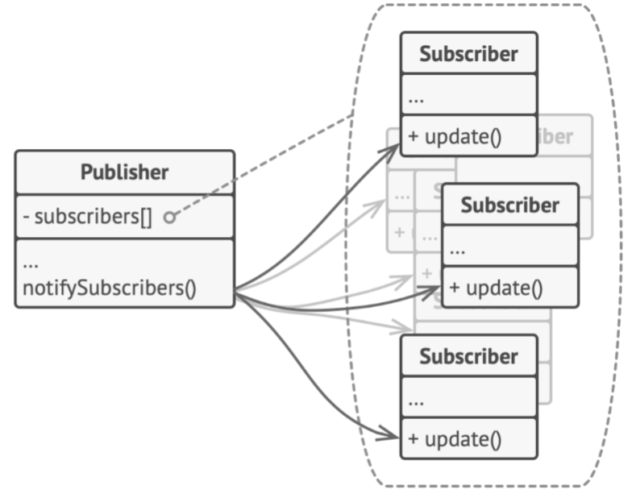
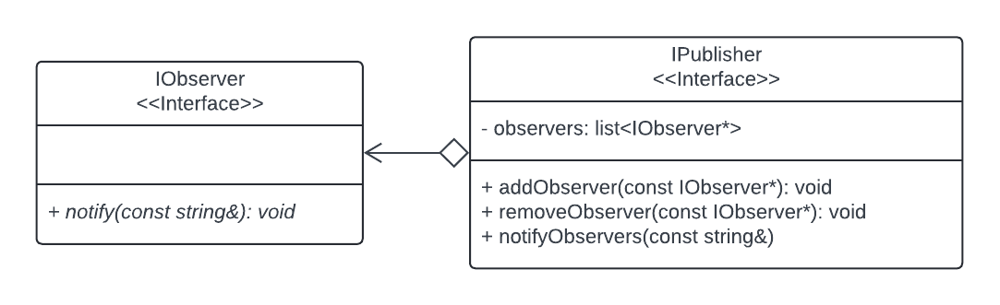
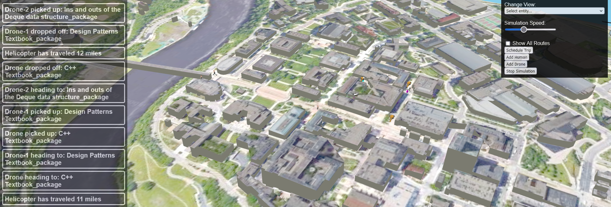

# 3081 Lab 10: Observer Design Pattern
_(Due: Thursday, November 14th, 2024 @ 11:59pm)_

## Accessing a Lab Machine

For this assignment, you should make sure you are using our shared CSE development environment.  As such, you should use a lab machine in ***Keller Hall 1-250*** or ***Keller Hall 1-262*** ([details](https://cse.umn.edu/cseit/classrooms-labs#cselabs)).  If you do not have physical access to one of the lab computers, you can also access a lab machine remotely using [SSH](https://github.umn.edu/umn-csci-3081w-f24-sec010/FAQ/blob/main/SSH/README.md) or a web-based service called [VOLE](https://github.umn.edu/umn-csci-3081w-f24-sec010/FAQ/blob/main/VOLE/README.md). If using VOLE, be sure to use VOLE-FX3 for full compatibility.  You will use your CSE Labs account to login to the lab machines. If you do not already have an account, create the account following these [instructions](https://wwws.cs.umn.edu/account-management).


**IMPORTANT: Inside the lab machine, only files saved to your home folder (e.g., `/home/lorim007`) will persist across sessions. If you log out, make sure your progress is pushed to GitHub or saved in the home folder.**

## Overwritten Unique Changes

All students are given the same base code for labs which are the solutions to the previous lab. If you had any personal changes or implementations in previous labs that you want carried forward to the current or future labs, those changes will need to be manually copied over by you, the developer.


## Retrieve Class Materials

1. Clone your team's repository for the lab.  This will require your section number and your team number.  If you need a reminder of your team number, check the announcements on Canvas for the project groups that were released.  You will be able to view the master list of groups with their associated numbers. **Replace the `sectionID` with your lecture section and `teamNumber` with your team number x500.**.
	```bash
	git clone git@github.umn.edu:umn-csci-3081w-f24-sec010/team-sectionID-teamNumber.git
	```
	Example: If you're team-020-77, your command would be...
	```bash
	git clone git@github.umn.edu:umn-csci-3081w-f24-sec010/team-020-77-lab10.git
	```

## What's in the lab10 folder?

<ul>
	<li>  <code>README.md</code>: You're reading this right now.
	<li>  <code>.gitignore</code>
	<li>  <code>dependencies</code>: A folder that contains external tools and libraries to compile and run the project.
	<li>  <code>docs</code>: Documentation files
	<li>  <code>service</code>: A folder with base code.  This contains:
  	  <ul>
  		  <li>  <code>include</code>: Header files
  		  <li>  <code>src</code>: Source files
  	  </ul>
	<li>  <code>web</code>: Front-end files
</ul>


## Lab Instructions

### Goal
  The primary goal of this lab is for you to implement notifications using the Observer design pattern. Entities within the simulation will be publishers that can post messages to the front-end of the simulation.


## Tasks
| ID | Title | Task Summary Description | Task Deliverable |
| :---: | --- | --- | --- |
| | Sending Notifications via Observer Pattern | | |
| Task 1 | Creation of IObserver and IPublisher | Create base observer classes | Source code |
| Task 2 | Integration with SimulationModel | Refactor SimulationModel to be an observer | Source code |
| Task 3 | Integration with Human and Helicopter | Update Inheritance hierarchy and display notifications | Source code |
| Task 4 | Integration with Drone | Update Inheritance hierarchy and display notifications | Source code |

## Concept: Observer Pattern

The Observer Pattern is a behavioral design pattern that lets you define a subscription mechanism to notify multiple objects about any events that happen to the object they’re observing.

<p align="center"> </p>


Imagine your favorite sports team is playing but you're not at the game. You
want to get the most up-to-date score and know when something big or exciting
has happened in the game. You could sit there constantly refreshing the score 
and events checking to see if anything has happened or changed. This can be a 
waste of your time though, especially if nothing has happened. 

It would be better if you received a notification every time an event happened. This is the idea with many sports apps. You can subscribe or unsubscribe to your favorite team(s). When an event happens in a match that one of your teams are playing in, you, the subscriber, are notified of this event. Now you can go back to dinner with your friends and family without constantly checking your phone! (until you receive a notification)

In this example, you, the user, would be the subscriber and the publisher would be the service that tracks the game. 


## Implementing Notifications

### Group Tasks:

All tasks will require you to adhere to the Google Code Style guide, add Doxygen comments, and make sure that the code compiles.


### Task 1: Creating the base classes


<p align="center"> </p>

Create the classes shown in the UML above. The files should be created in an "observer" directory within simulation model.
```
<repo_base>/service/include/simulationmodel/observer
<repo_base>/service/src/simulationmodel/observer
```
#### IObserver
Because IObserver is just an interface that will be realized by any class inheriting from it, this class has no source (.cc) file. With this, `notify` should be a purely virtual method which specifies a function that a publisher can send a message or notification to.


#### IPublisher
* Attributes:
  * `observers`: A list of pointers to any `IObservers` subscribed to the publisher. _Note: observers can be any iterable data structure like `std::set` or `std::vector`._
* Methods:
  * `addObserver(const IObserver*)`: Adds an observer to the `observers` list.
  * `removeObserver(const IObserver*)`: Removes an observer from the `observers` list if the observer is present in the list.
  * `notifyObservers(const string&)`: Notifies all observers in the observers list with the message that was passed in.


### Task 2: Integration with Simulation Model

Your front-end team has updated the simulation so that certain JSON messages can be sent to the front end, and have the message show up in the notification bar. (The notification bar is the shaded bar on the left side of the simulation.)

The front-end team has specified that the front end takes a JsonObject with a string in the "message" key-value pair, and posts the value to the bar. In order to get this data to the correct handler within the front end, the event that has to be specified is a "Notification" with the `sendEventToView` method.

Steps:
1. Refactor the Simulation model to inherit from `IObserver`
1. In SimulationModel, realize the `IObserver::notify(...)` method to take the passed in message, bundle it within a JsonObject, and send it to the front end.
1. When new entities are created, the SimulationModel shall _subscribe_ to the entity/publisher.

### Task 3: Integration with Human and Helicopter

Because we want **any** entity to be able to send messages to the front end, we need to extend the IEntity class to inherit from the `IPublisher` class. 
To test this functionality we will update two classes, Human and Helicopter, with some logic to periodically send notifications to the front end when specific events occur.

Steps:
1. Refactor `IEntity` to inherit from `IPublisher`.
1. `Human`: When the human goes by Keller Hall, the human shall notify the front end with a message with the following format. "<human_name> visited Keller Hall."
   * Keller Halls coordinates are `{64,254,-210}`
   * The human does not need to _exactly_ pass over the coordinates of Keller, but should be visibly close enough to trigger this message.
   * The human shall only send one notification per visit to Keller. _(No spam of messages for a single visit)_
1. `Helicopter`: For every mile that the helicopter travels, the helicopter shall notify the front-end with a message with the following format. "<helicopter_name> has traveled <miles> miles."
   * This may require additional attributes within the Helicopter class to calculate how far the helicopter has traveled in total and each timestep.
   * The simulation is about 2 miles wide (1.87 miles east to west) and (1.08 miles north to south). This works out to `1625 units per mile`.
   
### Task 4: Integration with Drone

Make sure that `IEntity` inherits from the `IPublisher` class.

We want to think about the events that we are interested in within our simulation in relation to the drone delivery. For this lab, we would like to be notified when:
* A drone is scheduled and moving to a package
* A package is picked up
* A package is dropped off

**For each of these events, a descriptive message detailing the names of the drones and packages involved is required.** For example, a message like "Drone has picked up a package" will not net any points as we don't know what drone or what package the message pertains to.

<p align="center"> </p>

# Final Submission
**One submission per group. Designate someone to make the submission, then add members to the submission!**

Before submitting, make sure that...
- Your code compiles and runs from a clean directory.
   - `make clean; make -j`
- Appropriate Doxygen documentation is generated with `make docs`
- You have NO CPP lint errors from `make lint`
- Your teammates do a code review on your pull request into the dev branch.

To submit your lab:

1. Create a pull request from your team's development branch into your main branch. 

   [FAQ: How to Create a Pull Request on Github](https://github.umn.edu/umn-csci-3081w-f24-sec010/FAQ/tree/main/Github%20Pull%20Requests)


1. Get the latest commit ID from your development branch and submit it to the Gradescope assignment "lab10: Observer Design Pattern" with your team name. Only 1 group member should submit a Gradescope assignment for the lab. Make sure that you add your teammates to the submission. See the FAQ link below on how to do this.  **DO NOT merge the pull request.**

   [FAQ: How to get a commit ID](https://github.umn.edu/umn-csci-3081w-f24-sec010/FAQ/blob/main/Commit%20ID/README.md)

     [FAQ: Gradescope Group Submissions](https://github.umn.edu/umn-csci-3081w-f24-sec010/FAQ/blob/main/Gradescope%20Include%20Teammates/README.md)

Once you have done both steps above, you have completed the lab.
