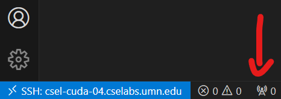
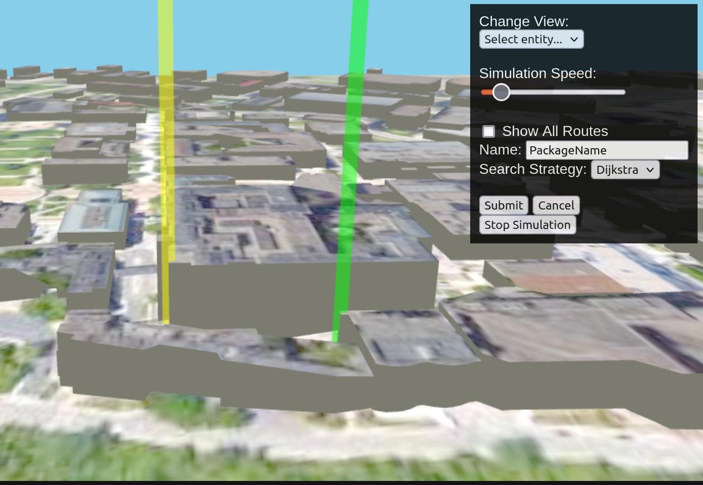
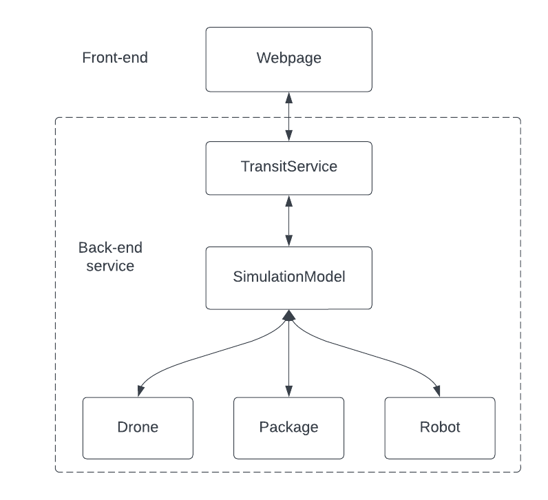
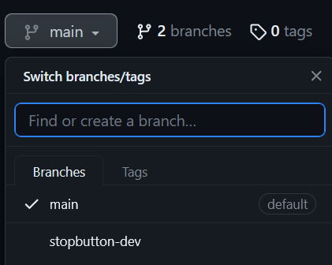

# 3081 Lab04 - Project Base code and Ethics
_(Due: Thursday, October 3, 2024 @ 11:59pm)_

How did lab03 go? Not a student favorite, but an important one to be sure. I also think the concepts covered should have helped with Homework 1 (or *will* help if you haven't started HW1 yet...If you haven't started yet, you might want to get on that.) We're now past the stage of teaching you C++. It's time to take the training wheels off now that we trust that you can hold your own with troubleshooting, researching, and solving problems in C++. 

We finally get to get into the project code. Starting from this lab, every lab here on out will be extending this simulation by adding new features through design patterns. I encourage you to spend plenty of time exploring the files here and get familiar with the project as this will be your home for the rest of the semester within 3081.

## What You Will Learn

1. How to compile and run the base code for the project.
2. How data flows between the front end and back end of the project (and projects in general).
3. How to connect a front-end button to a back-end action.
4. What IEEE's Code of Ethics is and how it applies to software professionals.

## General Information

### Accessing a Lab Machine

For this assignment, we suggest you use a lab machine in ***Keller Hall 1-250*** or ***Keller Hall 1-262*** ([details](https://cse.umn.edu/cseit/classrooms-labs#cselabs)). You can also access a lab machine remotely using [SSH](https://github.umn.edu/umn-csci-3081w-f24-sec010/FAQ/blob/main/SSH/README.md) or a web-based service called [VOLE](https://github.umn.edu/umn-csci-3081w-f24-sec010/FAQ/blob/main/VOLE/README.md). If using VOLE, be sure to use VOLE-FX3 for full compatibility.  You will use your CSE Labs account to login to the lab machines. If you do not already have an account, create the account following these [instructions](https://wwws.cs.umn.edu/account-management).


**IMPORTANT: Inside the lab machine, only files saved to your home folder (e.g., `/home/lorim007`) will persist across sessions. If you log out, make sure your progress is pushed to GitHub or saved in the home folder.**

## Retrieve Class Materials

1. Clone your personal repository for the lab. **Replace the x500 with your personal x500.**
    ```bash
    git clone git@github.umn.edu:umn-csci-3081w-f24-sec010/x500-lab04.git
    ```
### What's in the lab04 folder?

<ul>
  <li>  <code>README.md</code>: You're reading this right now.
  <li>  <code>.gitignore</code>
  <li>  <code>dependencies</code>: A folder that contains external tools and libraries to compile and run the project.
  <li>  <code>service</code>: A folder with base code.  This contains:
    <ul>
      <li>  <code>include</code>: Header files
      <li>  <code>src</code>: Source files
    </ul>
  <li>  <code>web</code>: Front-end files
</ul>

### Routing & Simulation Model Folders

Within each `include` and `src` folder are `routing` and `simulationmodel` folders. The code in the `routing` folders deals with building the navigation graph that the simulation relies on. The code in the `simulationmodel` folders contains the simulation that consists of entities and features that runs on a web server.

### Lab Goal

At the end of this lab, you will be able to compile and run the simulation. You will understand the flow of information from the front end to the back end. You will be able to stop the simulation from the front end. Lastly you will understand how to interact with the simulation by scheduling deliveries.


### Design Choices ##
As you delve deeper into 3081, we encourage you to adopt the mindset of a developer tasked with creating software for a client. Doing so can aid you in navigating the course and understanding the expectations placed upon you as a developer or student in this simulated work environment. It's important to recognize that every workplace operates differently, meaning that while we strive to emulate post-graduation experiences, there may still be variations.

In the realm of software development, there are instances where clients may not provide explicit instructions or requirements, leaving developers to make design choices. However, this can sometimes leave developers feeling uncertain or hesitant about assuming such decision-making responsibilities. In such situations, it is imperative for developers to promptly communicate with the customer or, in an educational setting, seek guidance from teaching assistants or instructors. This ensures that the final product closely aligns with the customer's expectations and helps developers avoid potential missteps or misunderstandings.

# Build and run in different environments


### Getting Started on a Local Lab Machine

Here is a quick overview of how to run the visualization (If you are using ssh, navigate to [ssh category below](#getting-started-using-ssh-into-cse-lab-machines)):

  ```bash
    # Go to the project directory
    cd /path/to/repo/project
    
    # Build the project
    make -j
    
    # Run the project (./build/web-app <port> <web folder>)
    ./build/bin/transit_service 8081 web/dist/
    # OR
    make run
  ```

In a web browser, navigate to http://127.0.0.1:8081 and you should see a visualization.
_Note: You may not be able to bind to the port. If you started the transit_service with a different port, you will need to change the link to that port._


*Note: 8081 will depend on what port you used. If you use port 8082, then it will be http://127.0.0.1:8082 instead.*


## Getting Started using SSH into CSE Lab machines

1. SSH into a CSE Lab Machine using **port forwarding** for the UI

   **Note:** If port `8081` is not available, choose a different port (e.g. 8082, 8083, etc...)

    ```bash
    ssh -L 8081:127.0.0.1:8081 x500@csel-xxxx.cselabs.umn.edu
    ```
    
    Example:
    ```bash
    ssh -L 8081:127.0.0.1:8081 lorim007@csel-kh1250-05.cselabs.umn.edu
    ```

2. Compile the project (within ssh session)

    ```bash
    cd /path/to/repo/project
    make -j
    ```
    
 3. Run the project (within ssh session)

    ```bash
    ./build/bin/transit_service 8081 web/dist/
    ```
    or
    ```bash
    make run
    ```

3. Navigate to http://127.0.0.1:8081 and you should see a visualization.

4. To stop the simulation, go to the terminal that you are running the simulation on and hit CTRL+C.

## SSH Through VS Code
If you are using Visual Studio Code on your personal machine and SSH'd into a school machine to run the project, you can set up Visual Studio Code to handle port forwarding for you!

1. Once connected through VSCode-SSH, look for a radio tower logo at the bottom of the application and click it.

2. This will bring up a sub-window with a box saying "Forward a port". Click on the box.
3. In the column that says **Port**, add an entry for whatever port you would like to forward to your local machine. Once submitted, you should see something like this.

4. You should now be good to navigate to `http://127.0.0.1:forwardedPortNumber` in your browser (if you have the project up and running) and see the drone simulation! 

## Using VOLE-FX3

**You must use [VOLE-FX3](https://csel-vole-fx3-prd.cselabs.umn.edu:3443/auth/ssh/)!** VOLE and VOLE3D will not work due to outdated dependencies.

1. See [here](https://github.umn.edu/umn-csci-3081w-f24-sec010/FAQ/tree/main/VOLE) on how to start using VOLE.


2. Compile the project within a terminal

    ```bash
    cd /path/to/repo/project
    make -j
    ```
    
  3. Run the project

      ```bash
      ./build/bin/transit_service 8081 web/dist/
      ```

  4. Navigate to http://127.0.0.1:8081 in a web browser and you should see a visualization.

  5. To stop the simulation, go to the terminal that you are running the simulation on and hit CTRL+C.

### Front End Compilation

If you've been observant during the project compilation, you may have noticed some unusual text that differs from standard g++ compilation output. This is because the front end is coded in [TypeScript](https://www.typescriptlang.org/) and is compiled into JavaScript using Node.js. Consequently, every time you compile the project using make, the front end also needs to be compiled. This underscores the importance of using `make -j` instead of just `make` during compilation, as it can potentially save you hours throughout the semester.

Ensure that you are connected to the internet when initially compiling your code, as the makefile configures the necessary Node packages.

### Localhost (127.0.0.1) and Ports ###

While this class may not delve deeply into the concepts of networks and routing, having a basic understanding of localhost and ports will prove beneficial.  You will encounter these terms regularly when working on this project. Let's briefly explore an explanation of ports and localhost to shed light on some of the previously unexplained steps.

  In a network, computers are identified by addresses, most notably [IP addresses](https://en.wikipedia.org/wiki/IP_address), which facilitate the routing of traffic within the network. A computer typically has an IP address such as 192.168.1.100, which serves to address it within the network. However, when a computer needs to address itself, it uses the localhost address, which is `127.0.0.1`. This is essentially the computer's way of saying 'Me.' Additionally, we can *sometimes* use the `localhost` name, which resolves back to `127.0.0.1` within the machine. You can experiment with this by running the simulation and using both addresses.
 
  - https://localhost:8081
  - https://127.0.0.1:8081

  And you will be taken to the same page.

  **Ports** in a computer serve as "gateways" and tools that processes utilize to send and receive data to and from another computer or endpoint. By default, web browsers commonly use port 80 or 8080 for data transmission, although they are not restricted to these ports alone. However, since these ports are frequently employed and only one process can be bound to a port at a time, alternative ports like 8081 or 8082 become necessary. Consequently, encountering an error when starting a server in an SSH session, indicating inability to bind to the desired port, may simply imply that another student is using the same machine and port. In such cases, consider switching machines or attempting a different port.

  These concepts will be introduced and covered in greater detail in CSCI4061, providing a deeper understanding beyond the brief overview provided here. We will return the focus to the project itself, but hopefully now you have this sufficient information to provide insight into the broader context of this code.

# Simulation

**Do not continue in the lab until you have been able to compile, build, run and view the simulation.**

## Front End Overview
In your simulation, please locate the menu positioned at the top right corner of the screen. This menu houses the controls for managing the simulation.


  * **Change View**: This option enables you to adjust the camera view and focus on specific entities within the simulation.
  * **Simulation Speed**: Use the slider to control the frequency of updates in the simulation per server 'tick.'
  * **Show All Routes**: Select this radio button to display an overlay of the routes available for entities to traverse in the simulated environment.
  * **Schedule Trip**: Click this button to activate "scheduling trip mode." Further details will be discussed below.
  * **Stop Simulation**: This button halts the simulation server. It does not currently perform any action.  You will integrate it with back end functionality as part of this lab.

### Scheduling A Package
As mentioned in the list above, clicking the "Schedule Trip" button should change the menu to allow the user to schedule a delivery.



From this interface, you have the option to name the package, change the search strategy that the drone will use to deliver the package from the yellow start location to the green drop-off location, and use the submit and cancel buttons. Once the package name, strategy, start, and drop-off locations have been set, you can click the submit button to create a task for the drone. If during any point you no longer want to schedule a delivery, you can click "Cancel" to exit this mode.

This scheduling mode allows you to pick the start and end/destination locations for your delivery using the map.  The destination is designated in yellow, while the starting point is in green.  **NOTE:** The program will always set the destination first and the starting point second.  To set locations on the map you should first click the map position where the delivery will end, and then click the map position for the starting point. 


## Data Flow

A simple block diagram overview of the data flow in this program can be seen here.




## Linking the Stop Button ##

Stopping the simulation by going to the terminal and mashing CTRL+C feels a little... barbaric... for our client's taste. Our task in this section of the lab is to add a "Stop Simulation" button to the front-end \[Webpage\] piece of our software to have it carefully stop the back-end C++ code.


### Modifying the Back End (C++) ###
Thankfully, your front-end development team has already added the button to the webpage as well as added the logic to send a stop message to the back end. Your job is to modify the back-end code to handle this message and gracefully stop the simulation.

1. Start off by making a development branch for this new feature. Make the branch name descriptive and representative of the feature. Something like `stopbutton-dev` tells _enough_ about what this branch is. For a reminder on how to make a new branch, revisit [Public-lab01](https://github.umn.edu/umn-csci-3081w-f24-sec010/public-lab01). Here is a quick reminder too.
    ```bash
    git checkout -b stopbutton-dev
    ```

    **You must develop this new feature in this branch. Once this feature is done, you will merge it back into the main branch.**

1. Look at the [Data Flow](#data-flow) diagram again. We can see that the entry point from the front end to our back end is the `TransitService` class. Let's take a look at that source file at `service/src/simulationmodel/TransitService.cc`.  This file contains a method to handle messages or commands from the front end, as well as a method to send messages to the front end which may come in use in later extensions.

    Find the method `receiveCommand(...)` at about line 17.

1. The `receiveCommand(...)` method is composed of a large if-else block to handle commands appropriately. According to the design specification, the command that is being sent is "stopSimulation." From here, let's extend this if-else block to handle this message.
    ```c++
    else if (cmd == "stopSimulation") {
      // Code to handle the stopSimulation command
    }
    ```
1. What do we put in here? Let's look at the loop that is running our simulation. Scroll down further in this file to the simulation's `main()` function and you will see this code.
    ```c++
    while (true) {
      server.service();
    }
    ```

    Here is a good example of a façade. You will learn more about the façade design pattern later in this class, but for now you can think of it as a way of hiding a bunch of complex functionality behind a simple interface. In this case, the entire simulation is being run in the while loop you see here.  Knowing that, if we want to stop this simulation, we're going to have to do something about that `true` value. We will come back to this.

1. Since both code blocks from the previous two steps exist in the same file we can make a quick fix to implement this feature. Somewhere in the file **outside of any class or function** make a global variable (_sacrilegious, I know..._)
    ```c++
    // Global value if simulation has been stopped
    bool stopped = false;
    ```

2. Go back to the `main` function and update the while loop to utilize this boolean.
    ```c++
    // If the simulation isn't stopped
    while (!stopped) {
      // Keep updating it
      server.service();
    }
    ```
3. Last but definitely not least, we just need to make sure this `stopped` boolean value changes when we receive the stop command. Go back to `receiveCommand(...)` where we added an if-else statement to handle the "stopSimulation" command. In here, set the stopped flag to true, and add a message saying that the simulation has stopped due to a command.
    ```c++
    else if (cmd == "stopSimulation") {
      std::cout << "Stop command administered\n";
      stopped = true;
    }
    ```

    Once this is done, you should [compile, build and run the simulation](#build-and-run-in-different-environments). Your simulation should now gracefully stop when you click on the "Stop Simulation" in the front-end webpage.

### Submitting your Code Changes in Lab ###

1. All of your development should have been done in a branch that **is not main**.
1. Once you have verified that the feature is done, you should stage, commit and push your development branch to `origin`. 
    ```bash
    git push --set-upstream origin <branch-name>
    ```
    Then we should be able to see this branch on GitHub.

    
1. From here, checkout the main branch with `git checkout main`
1. Merge the development branch into main.
    ```bash
    git merge <development-branch>
    ```
1. Push this merge so that `main` and your development branch are synced on the github server (origin).
1. Grab the latest commit ID and submit this to gradescope.

## IEEE Code of Ethics for Software Engineers ##
Take the Gradescope quiz "Lab04 - IEEE Code of Ethics for Software Engineers"  This quiz can be completed alone or with a friend, and you can take it as many times as you would like until the due date. Note that if you work and discuss with a partner, you both still have to complete the quiz for each of you to receive credit. The link below will help you complete the quiz.
 
[IEEE Code of Ethics for Software Engineers](https://www.computer.org/education/code-of-ethics)

## Submission ##

- (40%) Push all of your code changes to your GitHub repository. 
  - Then post on the Gradescope assignment for lab04, your x500 and the commit ID for your submission.
[Click here](https://github.umn.edu/umn-csci-3081w-f24-sec010/FAQ/blob/main/Commit%20ID/README.md) to see how to obtain commit ID.

- (60%) Complete the Gradescope quiz on IEEE Code of Ethics for Software Engineers

