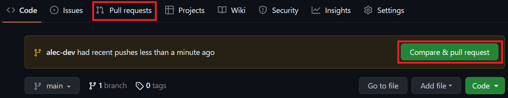
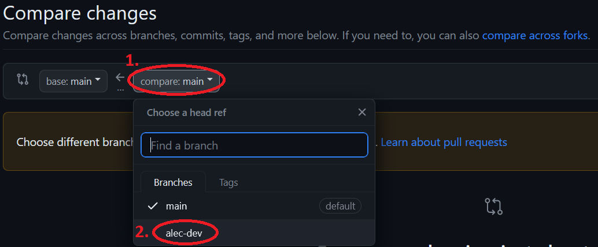
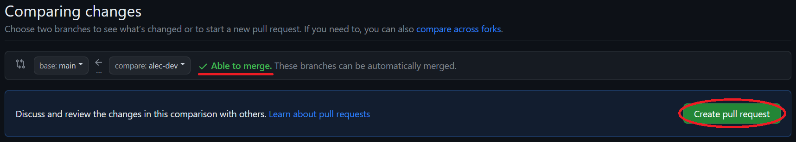
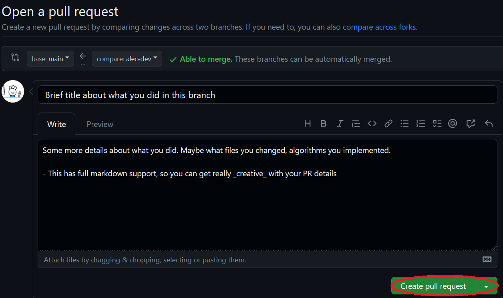
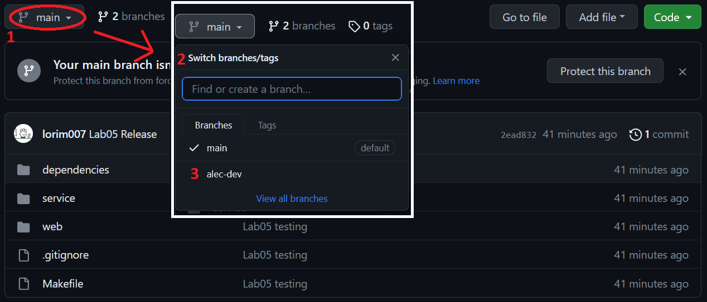

# 3081 Lab 5: Code Styling & Doxygen
_(Due: Thursday, October 10, 2024 @ 11:59pm)_

## What You Will Do

1. Learn about and understand the importance of adhering to style guides and using linters to maintain code quality.
1. Identify and fix style guide violations in provided C++ code.
1. Add Doxygen documentation to the provided C++ codebase to enhance its readability and maintainability.
1. Create a pull request using Github's webpage.

## Accessing a Lab Machine

For this assignment, we suggest you use a lab machine in ***Keller Hall 1-250*** or ***Keller Hall 1-262*** ([details](https://cse.umn.edu/cseit/classrooms-labs#cselabs)). You can also access a lab machine remotely using [SSH](https://github.umn.edu/umn-csci-3081w-f24-sec010/FAQ/blob/main/SSH/README.md) or a web-based service called [VOLE](https://github.umn.edu/umn-csci-3081w-f24-sec010/FAQ/blob/main/VOLE/README.md). If using VOLE, be sure to use VOLE-FX3 for full compatibility.  You will use your CSE Labs account to login to the lab machines. If you do not already have an account, create the account following these [instructions](https://wwws.cs.umn.edu/account-management).


**IMPORTANT: Inside the lab machine, only files saved to your home folder (e.g., `/home/lorim007`) will persist across sessions. If you log out, make sure your progress is pushed to GitHub or saved in the home folder.**

## Retrieve Class Materials

1. Clone your personal repository for the lab. **Replace the x500 with your personal x500.**
    ```bash
    git clone git@github.umn.edu:umn-csci-3081w-f24-sec010/x500-lab05.git
    ```
## What's in the lab05 folder?

<ul>
  <li>  <code>README.md</code>: You're reading this right now.
  <li>  <code>.gitignore</code>
  <li>  <code>dependencies</code>: A folder that contains external tools and libraries to compile and run the project.
  <li>  <code>service</code>: A folder with base code.  This contains:
    <ul>
      <li>  <code>include</code>: Header files
      <li>  <code>src</code>: Source files
    </ul>
  <li>  <code>web</code>: Front-end files
</ul>

# Part 0 - Required! Git Branch & Pull Requests

## Base Code Double Check ##
From [last week's lab](https://github.umn.edu/umn-csci-3081w-f24-sec010/public-lab04), we now know how to compile and run the project. All base code given in labs will compile and run on machines specified in the [accessing a lab machines](#accessing-a-lab-machine) section. You should verify this by building and running the base code before you start the lab. If this code does not build and run on the given machines, please contact a teaching assistant.

## Git Branch & Pull Requests

It's now time to really start tackling this project.  We are approaching this from the viewpoint of a developer in a company working on a long-term project with other teammates and developers, so we want to get you used to good practices when developing in a team environment. Just like last week's lab, you must make an alternate branch separate from the main branch (called 'documentation') where you will be working on and completing your lab. Once you are done with the documentation portion of the lab in your documentation branch, you will be creating a pull request (PR) on GitHub to merge the documentation branch into main.

Start off by creating and checking out your documentation branch with the `git checkout -b <branchname>` command.  Remember that branch names should be relatively short and informative -- in a working environment, most documentation branches are called 'documentation'.

# Part 1 - Code Styling


## What are Linters and StyleGuides
A linter is a static code analysis tool that helps users(developers) flag style errors and bugs. For the purpose of this lab, we will mainly be using it to flag style errors.

A style guide is a set of guidelines to help developers neatly write their code.  Adhering to a style guide makes your own code more legible, and (perhaps more importantly) ensures that every member of a team is not writing code in their own way.

## CPP Lint and Google StyleGuide ##
CPPlint is an open source software written in python that enforces Google's C++ style guide. [Link to the CPPlint Repo](https://github.com/cpplint/cpplint) 

[Google's C++ Style Guide](https://google.github.io/styleguide/cppguide.html) is Google's public style guide that they use for their C++ code and is what they like and have determined is good practice. Other companies/schools like our class have chosen to use this style guide, though it is not the only one. As you get into industry you will work for companies that have their own "flavor" of styling their code, much like how you have a different style to your classmates.
## Lab Instructions

### CPPLint

You will be refactoring some of the code inside the `service/` folder to match the Google C++ style guide while maintaining the project structure.

1. Before you do anything else, compile and run the simulation to verify it works. You can run the program just as you did during the lab04. If it doesn't work, let the TAs know as soon as you can.

2. Before proceeding, make sure you are in the top folder and not inside the libs folder.
Run cpplint onto one of the `libs/transit/src` files (`Drone.cc`)
    ```
    cpplint --filter=-legal/copyright,-build/include,-build/namespaces,-runtime/explicit,-build/header_guard,-runtime/references,-runtime/threadsafe_fn service/src/simulationmodel/entity/Drone.cc 
    ```

    *Note: `--filter` flag means exclude what we do not want to check.*

3. It will produce multiple errors similar to the results below:

    ```
    cpplint --filter=-legal/copyright,-build/include,-build/namespaces,-runtime/explicit,-build/header_guard,-runtime/references,-runtime/threadsafe_fn service/src/simulationmodel/entity/Drone.cc 
    service/src/simulationmodel/entity/Drone.cc:12:  You don't need a ; after a }  [readability/braces] [4]
    service/src/simulationmodel/entity/Drone.cc:14:  Missing space before {  [whitespace/braces] [5]
    service/src/simulationmodel/entity/Drone.cc:15:  Missing space before ( in if(  [whitespace/parens] [5]
    service/src/simulationmodel/entity/Drone.cc:16:  Missing spaces around =  [whitespace/operators] [4]
    service/src/simulationmodel/entity/Drone.cc:17:  Line ends in whitespace.  Consider deleting these extra spaces.  [whitespace/end_of_line] [4]
    service/src/simulationmodel/entity/Drone.cc:19:  { should almost always be at the end of the previous line  [whitespace/braces] [4]
    service/src/simulationmodel/entity/Drone.cc:28:  { should almost always be at the end of the previous line  [whitespace/braces] [4]
    Done processing service/src/simulationmodel/entity/Drone.cc
    Total errors found: 7
    ```

4. This means there are 7 errors in the Drone.cc file which don't match the Google code style guide.

5. Modify Drone.cc until there are 0 errors left. CPPLint will output nothing to the terminal if there are no errors left.
    ```
    Done processing service/src/simulationmodel/entity/Drone.cc
    ```

6. For the next steps you can clean up the code manually or you can refer to the [VS Code Linting Plugin](#optional-vscode-linting-integration) to clean your code automatically.

7. Repeat the steps above for **all the files** inside `service/src/simulationmodel` and `service/include/simulationmodel` **excluding** the `math` and `util` folders until there are **0** errors left. You can run the cpplint for all of the required files using the make command below
    ```
    make lint
    ```

8. Rerun the simulation and see if the drone and robots are still being generated. If not, something went wrong while you were cleaning up the code. Fix this first before submitting. If it works as usual, you are good to go.

### Optional: VSCode Linting integration ###
You can set up Visual Studio Code to do the linting for you while you code. A quick readme on how to do this can be found [here](https://github.umn.edu/umn-csci-3081w-f24-sec010/FAQ/blob/main/VSCode%20CPPLint/README.md) in the classes FAQ.

# Part 2 - Doxygen

_Did you remember to make that documentation branch? Reminder that all of these changes should be done in a documentation branch not on main. If you are not in a documentation branch, please refer back to the setup in [step 0](#part-0---required-git-branch--pull-requests)._

## What is Doxygen?

Doxygen is a documentation generation tool. It does not *write* the documentation, but rather has a syntax that developers use to write documentation in their source/header files.  Doxygen will then parse any documentation written with that syntax to make a variety of different types of documentation that can be used for the project. The documentation files generated by Doxygen include API documentation, code structure, call graphs, class hierarchies, and file and directory structures, to name a few.

Doxygen is a highly configurable tool that is used by [many projects](https://www.doxygen.nl/projects.html).  Since it's so incredibly flexible we won't be doing a deep dive today, but we will be going over a few of the basics in this lab.


## Lab Instructions


1. Navigate to your lab repo
    ```bash
    % cd <path_to_directory>
    ```
2. Create the configuration file.

    To start generating documentation, you must first generate a Doxygen
    configuration file in the docs directory. Run the following command from the top level of the
    lab05 directory (where this README is).

    ```
    mkdir docs
    doxygen -g docs/Doxyfile
    ```
    *Note: `mkdir` is used to create directory*

    You will now see a new file **Doxyfile** in the <code>docs</code> directory.

3. Modify the Doxyfile to look in the <code>service</code> folder when compiling (i.e, only the folder that was set as an input will get the examination from doxygen). You can do this by setting the **INPUT** tag of your **Doxyfile**. Since this lab requires you to write Doxygen-formatted documentation for only certain files/classes, you would need to point the Input to <code>service/</code>. It should be around `line 832` within `Doxyfile`.

    ```
    INPUT                  = "../service/"
    ```

    You will also want to set **RECURSIVE** tag of your **Doxyfile** to YES so that all the code inside the folder you set for the input will be accounted for. This should be around `line 911` within `Doxyfile`.

    ````
    RECURSIVE              = YES
    ````
    
    Now set the **EXCLUDE** tag to the parsers and util folders. This tag is used if you do not want Doxygen to look at the provided path folders. You can find the EXCLUDE tag around `line 920`.
    ````
    EXCLUDE                = "../service/include/simulationmodel/util" \
                             "../service/include/routing" \
                             "../service/src" \
    ````
    
    Finally, set the **PROJECT_NAME** tag from "My Project" to "CSCI3081W Drone Delivery System". You can find the tag around `line 31`.
    ````
    PROJECT_NAME           = "CSCI3081W Drone Delivery System"
    ````
    
    The path is relative to the directory from which you run/compile Doxygen. ***It is important that you set it up to run from the `docs/` directory***. Doxygen will not inform you if it does not find the src directory -- it just won't generate any files from your classes.


4. Generate the HTML pages for this lab. Run the following commands:
    ```
    cd docs
    doxygen Doxyfile
    ```
    You can now view the generated documentation from the `index.html` file in the
    `html` directory that was generated inside the docs folder. Open the `index.html` page which is referred to as the *landing page*. Explore the various menus to see how the comments in the code are organized in the HTML. Hover on the Classes menu and click on `Class List`. Here you will see different classes.
    
## How do you access the index.html file?

There are multiple ways that you can open the index.html file. If you are SSHing with VSCode, please refer to this [link](https://github.umn.edu/umn-csci-3081w-f24-sec010/FAQ/tree/main/VSCode%20Live%20Server) on how to install the VSCode Live Server extension to view HTML files. Otherwise, you can simply download the file locally and open it using File Explorer. If you are SSHing from the terminal, you will need to copy the file locally using the 'scp' command. If you are using a lab machine or VOLE, you can simply use File Explorer to open the HTML file.

5. Now modify the `service/include/simulationmodel/entity/Drone.h` file to add Doxygen comments.
  
    Use **@brief** to describe a class or method/function, **@param** to describe a parameter, and **@return** to specify a function's return value. You can also refer to Doxygen's [manual](https://doxygen.nl/manual/docblocks.html) for their commenting standards.

    Example:
    ```c++
    /**
     * @brief The summation of two numbers.
     * 
     * @param a First number.
     * @param b Second number.
     * @return Result of adding two number.
     **/
    float sum(float a, float b) {
      return a+b;
    }
    ```
    Classes. See `IController.h` for example:
    ```c++
    /**
    * @brief class for IController used for transit service. Uses the Model View
    **/
    class IController {
    ```

6. Here are the files that you need to document using Doxygen (Doxygen documentation only needs to be written for header files): 
    - service/include/simulationmodel/entity/
      - Drone.h
      - IEntity.h
      - Package.h
      - Robot.h
      - SimulationModel.h
      - **You are not required to comment on the class's attributes, but you must comment the class definition.**. However, we strongly encourage you to  take a look at these attributes to get a greater understanding of each class.

7. After you have written everything, recompile the Doxygen (step 4) and click on the `classes` menu. If all the classes and their methods are displayed similar to the `IController` or `Vector3` classes then you have completed this portion of the lab.
<br>


# Final Submission (Creating a Pull Request)
Before you submit, **your project should build and run**. None of the changes you have made in this week's base code should change any logic in the simulation itself. 

1. Push from your documentation branch up to GitHub so you can see the branch when you view your repository in a browser. Example:
    ```
    git add -A
    git commit -m "Code styling and Documentation"
    git push -u origin alec-dev
    ```
1. In a browser, your repository should look something like shown below.
    
    Click on either the "Pull requests" tab or the "Compare & pull request" button boxed in red.
    - If you clicked on the "pull request" tab, continue to the next step.
    - If you clicked on the green "Compare & pull request" button, go to step 6.
1. Click on the "New pull request" button in green towards the right side of the page.
1. Select the base branch that you will be merging into. In this case and by default, it will be the `main` branch. Then select the branch you want to compare. This should be changed to your documentation branch.

    

1. From here, verify that you are able to create this pull request by checking if the green text with a checkmark "Able to merge" is present. If it is, you can click the "Create pull request" green button on the right side.

    

1. Last, you will be brought to this page. From here leave a small title that will be your commit message when merging into main, and more details in the box below. When done, click the green "Create pull request" button in the bottom right.

    


Et voilà! You've _maybe_ created your first pull request. Your first of many in your life as a developer. For now, though, you still have a few more steps to complete the lab.

**DO NOT MERGE THE PULL REQUEST**.

To complete the lab, you must submit your assignment to the Gradescope assignment "Lab 5: Code Styling" with your repo link and the final commit ID for your submission. Keep in mind that finding the commit ID you need using the web GUI requires one more step now that you have no commits on main.

In the top left of the homepage of your repo, select the dropdown menu that says "main." You do not need to do this if the dropdown already has your documentation branch's name.



Then select your dev branch from the dropdown. From here, you can follow the regular instructions [here](https://github.umn.edu/umn-csci-3081w-f24-sec010/FAQ/blob/main/Commit%20ID/README.md) to see how to get a commit ID like you've done in previous labs. Once this commit ID is submitted to Gradescope, you are now done with the lab.
